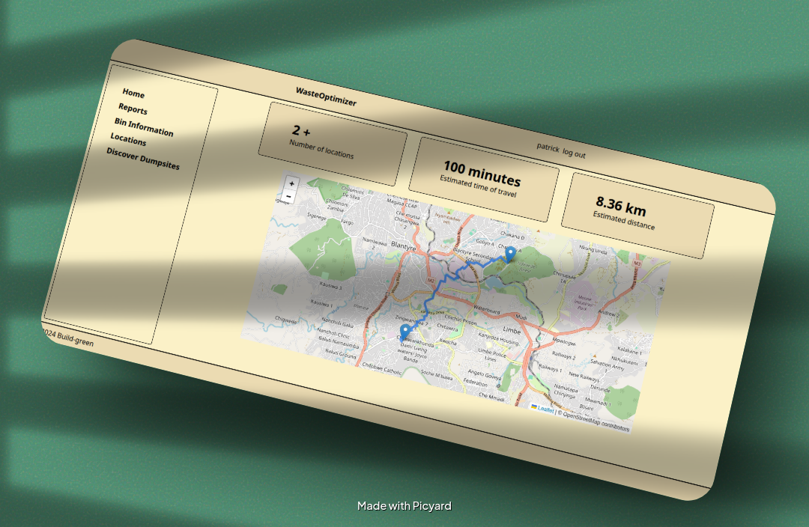

# Waste Management Optimizer

Waste Management Optimizer is a web application designed to plan and visualize optimized waste collection routes. It uses geospatial tools, real-time height data, and a sleek UI to support environmentally conscious waste disposal.


[](https://opensource.org/licenses/MIT)
[](https://www.python.org/downloads/)
[](https://flask.palletsprojects.com/)
[](https://github.com/facebookresearch/detectron2)



## Table of Contents

- [Overview](#overview)
- [System Architecture](#system-architecture)
- [Key Features](#key-features)
- [Technology Stack](#technology-stack)
- [Installation & Setup](#installation--setup)
- [Usage Guide](#usage-guide)
- [API Documentation](#api-documentation)
- [Project Deliverables](#project-deliverables)
- [Future Enhancements](#future-enhancements)
- [License](#license)

## Overview

This is a project that can be used to manage waste by combining IoT, Digital-platforms and AI. This improves the planning and monitoring of waste in a city with optimized routes, reports from citizens and even gas detection for bins containing dangerous material. This allows the trash collectors to be able to categorize the wastes

## System Architecture

### System Components

```
┌─────────────────┐    ┌─────────────────┐    ┌─────────────────┐
│   Web Frontend  │    │  Flask Backend  │    │  AI Detection   │
│                 │    │                 │    │                 │
│ • Leaflet Maps  │◄──►│ • Route Engine  │◄──►│ • Detectron2    │
│ • TailwindCSS   │    │ • API Gateway   │    │ • OpenCV        │
│ • Interactive   │    │ • Auth System   │    │ • PyTorch       │
│ • Jinja2        │    │ • Database      │    │ • Image Proc    │
└─────────────────┘    └─────────────────┘    └─────────────────┘
         │                       │                       │
         └───────────────────────┼───────────────────────┘
                                 │
                ┌─────────────────▼─────────────────┐
                │        External APIs              │
                │                                   │
                │ • OpenRouteService (Routing)      │
                │ • OpenStreetMap (Base Maps)       │
                │ • HeightAPI (Elevation Data)      │
                └───────────────────────────────────┘
```

### Technical Approach

- **Geospatial Intelligence**: Leverages OpenRouteService for multi-point optimization
- **Computer Vision**: Detectron2 framework for accurate dumpsite detection
- **Interactive Mapping**: Real-time visualization using Leaflet.js
- **Database Integration**: SQLite for user management and location storage

## Key Features

### AI-Powered Detection

- **Dumpsite Recognition**: Automated detection using trained Detectron2 models
- **Image Processing**: OpenCV integration for preprocessing and analysis
- **Custom Training**: Ability to retrain models with new datasets

### Advanced Route Optimization

- **Multi-point Routing**: Optimized paths through multiple collection points
- **Walking Route Planning**: Foot-walking profile optimization
- **Real-time Calculations**: Distance and time estimation
- **Interactive Visualization**: Dynamic map updates with route overlays

### Modern Web Interface

- **Responsive Design**: TailwindCSS for mobile-first approach
- **Interactive Maps**: Leaflet.js with custom markers and layers
- **User Authentication**: Secure login system with Flask sessions
- **Database Integration**: Location and sensor data management

## Technology Stack

| Component          | Technology                        | Purpose                       |
| ------------------ | --------------------------------- | ----------------------------- |
| **Frontend**       | HTML5, TailwindCSS, Leaflet.js    | Interactive user interface    |
| **Backend**        | Flask (Python), Jinja2            | Web framework and templating  |
| **AI/ML**          | Detectron2, PyTorch, OpenCV       | Computer vision and detection |
| **Geospatial**     | OpenRouteService API              | Routing and optimization      |
| **Mapping**        | OpenStreetMap, Leaflet tiles      | Base mapping services         |
| **Database**       | SQLite                            | Data persistence              |
| **Authentication** | Flask Sessions, Werkzeug Security | User management               |
| **Environment**    | Python 3.8+, Virtual Environment  | Development setup             |

## Installation & Setup

### Prerequisites

- Python 3.8 or higher
- Git
- Virtual environment support
- Internet connection for API access

### 1. Clone the Repository

```bash
git clone https://github.com/mtendekuyokwa19/gaiathon.git
cd gaiathon
```

### 2. Environment Setup

```bash
# Create virtual environment
python3 -m venv .venv

# Activate virtual environment
# On Linux/macOS:
source .venv/bin/activate
# On Windows:
# .venv\Scripts\activate
```

### 3. Install Dependencies

```bash

# Install project dependencies
pip install .

# Install Detectron2 (from source)
pip install git+https://github.com/facebookresearch/detectron2.git
```

### 4. Environment Configuration
=======
pip install  .
```

```env
ORS_API_KEY=your_openrouteservice_api_key
```

## Setting Up Detectro with Flask

This project integrates the Detectron2 object detection framework into a Flask web application for detecting dumpsites. If you're cloning this repository for the first time, follow the steps below to set up your environment.

### 5. Set up Detectron2

Detectron2 must be installed from source:

```bash
pip install git+https://github.com/facebookresearch/detectron2.git
```

Ensure your system meets the requirements for PyTorch and OpenCV.


### 5. Dataset and model setup


```env
# OpenRouteService API Configuration
ORS=your_openrouteservice_api_key

# Flask Configuration
FLASK_ENV=development
FLASK_DEBUG=True
SECRET_KEY=your_secret_key_here
```

**Note**: Get your free OpenRouteService API key from [heigit.org](https://heigit.org)

### 6. AI Model Setup


#### Dataset Preparation

```bash
# Ensure images have consistent dimensions
python resize.py
```

Edit the pathway inside resize.py if your data is in a different location.

#### Model Training

```bash
# Train the Detectron2 model
python train.py
```

This will create an `output/` folder in detectron. Move it to the upper layer of the folder so that Flask can easily access it.

**Important**:

- The trained model weights (`model_final.pth`) are not included due to GitHub's 100MB limit
- You'll need to train the model or obtain pre-trained weights
- Ensure your dataset follows COCO-style annotations

### 5. cloud deployment

- use of sqlite-cloud to allow communication between the IoT bins , webapp and Mobile-app

### 6. Launch Application

```bash
# Start the Flask development server
flask --app flaskr run --debug
```

Navigate to [http://127.0.0.1:5000](http://127.0.0.1:5000) to access the application.

## Usage Guide

### Basic Workflow

1. **Authentication**: Register or login to access the system
2. **Dashboard**: Access the main dashboard with navigation options
3. **Route Planning**: Automatic route generation from database locations via `/get_locations`
4. **Dumpsite Detection**: Upload satellite images for AI-powered analysis
5. **Data Management**: View reports, sensor data, and location information

### Application Endpoints

- `/auth/register` - User registration
- `/auth/login` - User authentication
- `/get_locations` - Automatic route from database locations
- `/dumpsite` - AI-powered dumpsite detection
- `/report` - View system reports
- `/sensor` - Monitor sensor data
- `/locations` - Manage location data

## API Documentation

### Route Optimization Endpoints

#### Automatic Route Generation

```http
GET /get_locations
```

**Returns**: HTML template with route visualization using Jinja2 templating

#### Dumpsite Detection

```http
POST /dumpsite
Content-Type: multipart/form-data

file=<image_file>
```

**Returns**: HTML template with detection results rendered via Jinja2

### Data Management Endpoints

#### View Reports

```http
GET /report
```

**Returns**: HTML template with database reports using Jinja2

#### Sensor Data

```http
GET /sensor
```

**Returns**: HTML template displaying sensor information

#### Location Management

```http
GET /locations
```

**Returns**: HTML template with location data from database

**Note**: All endpoints return HTML responses rendered through Jinja2 templating engine, not JSON APIs.

## Project Deliverables

This project fulfills all competition requirements:

### Repository Structure

```
gaiathon/
├── README.md                 # This comprehensive documentation
├── pyproject.toml           # Project configuration and dependencies
├── flaskr/                  # Main Flask application
│   ├── auth.py             # Authentication system
│   ├── dashboard.py        # Main application logic
│   └── db.py               # Database operations
├── detectro/               # AI detection components
├── static/                 # Frontend assets (CSS, JS, images)
├── templates/              # HTML templates with Jinja2
├── uploads/                # File upload directory
├── train.py                # Model training script
├── resize.py               # Image preprocessing utility
└── output/                 # Model weights and results
```

### Live Application

- **Deployment**: Fully functional web application
- **Features**: All core functionality implemented and tested
- **Database**: SQLite integration for data persistence
- **Authentication**: Secure user management system

### Technical Report

- **Implementation**: Complete Flask application with AI integration
- **Database Schema**: User management and location storage
- **API Design**: Flask endpoints with HTML responses
- **Testing**: Functional application ready for deployment

## Future Enhancements

### Technical Improvements

- **Database Migration**: PostgreSQL with PostGIS for production
- **API Enhancement**: JSON API endpoints alongside HTML responses
- **Performance Optimization**: Caching and query optimization

## Useful Resources

- **[Leaflet.js Documentation](https://leafletjs.com/)** - Interactive mapping library
- **[Detectron2 Documentation](https://detectron2.readthedocs.io/)** - AI detection framework
- **[Flask Documentation](https://flask.palletsprojects.com/)** - Web framework
- **[OpenRouteService API](https://openrouteservice.org/)** - Routing services
- **[TailwindCSS Documentation](https://tailwindcss.com/docs)** - Utility-first CSS

## License

This project is licensed under the MIT License - see the [LICENSE](LICENSE) file for details.

---

**Project Repository**: [https://github.com/mtendekuyokwa19/gaiathon](https://github.com/mtendekuyokwa19/gaiathon)  
**Built for sustainable waste management and environmental protection**
